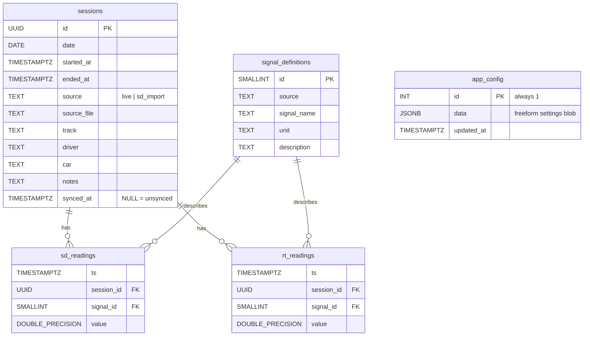

# Database

This directory holds the SQL migrations that build the local Postgres
schema. Migrations run automatically when the desktop app starts, in
filename order, and each one is applied at most once per database (tracked
in `schema_migrations`). The runner is `desktop/main/src/db/migrate.ts`.

## Schema

### What each table is for

- **sessions** — one row per recording. Either a live capture off the car
  (`source='live'`) or an imported `.nfr` file (`source='sd_import'`).
  `synced_at` tracks whether the row has been pushed to the cloud.
- **signal_definitions** — the catalog of every signal the parser knows
  about, keyed by `(source, signal_name)`. e.g. `(BMS, BMS_SOC)`.
- **sd_readings** — historical readings from imported `.nfr` files. The bulk
  of the data. Indexed for `(session_id, signal_id, ts)` lookups.
- **rt_readings** — the live ring buffer for current-session real-time
  frames. Indexed `(signal_id, ts DESC)` so the dashboard can grab the
  newest values cheaply.
- **app_config** — singleton JSONB row holding settings that aren't worth
  their own column (DBC path, broadcast token, cloud sync creds, etc.).

## Migrations

| File | What it does |
|------|--------------|
| `0001_init.sql` | Initial schema: the five tables above. |
| `0002_rpcs.sql` | `get_session_signals(session_id)` and friends — server-side helpers the app calls. |
| `0003_fix_sd_import_tz.sql` | One-time backfill that shifts old `sd_import` timestamps from "wall-clock-tagged-as-UTC" to actual UTC. The `.nfr` reader used to misinterpret the car's RTC; pre-v0.3.9 sessions were rendering 5–6h earlier than reality. |

To add a migration: create the next-numbered `.sql` file, write idempotent
DDL where reasonable. The runner wraps each file in a transaction; failures
roll back cleanly.

## Cloud schema (Supabase)

The cloud DB mirrors the local schema, with two differences:

1. **`sd_readings` is partitioned by month** (`sd_readings_2026_03`,
   `_2026_04`, …). Lets entire months be dropped in O(1) and keeps query
   plans tight. The local DB doesn't bother with partitioning — the volumes
   are smaller and partitioning has overhead.
2. **`UNIQUE (session_id, ts, signal_id)` on `sd_readings`** and
   **`UNIQUE (source, signal_name)` on `signal_definitions`** — both let
   sync use `ON CONFLICT DO NOTHING` so retries are idempotent.

Everything else (column names, types, FK shape) is the same.

## Sync notes

How sync handles `signal_id` differences across DBs: each Postgres has its
own auto-increment, so local `signal_id=42` may be `signal_id=87` on the
cloud. The pusher upserts `signal_definitions` first by `(source,
signal_name)`, gets back the cloud ids, and translates the readings before
inserting. See `desktop/main/src/sync/supabase.ts:pushSessionsToCloud`.

## Storage cleanup history (cloud only)

These were one-off ops run via Supabase migrations, not part of the local
migration sequence. Recorded here so the reasoning isn't lost.

| When | What | Why | Saved |
|------|------|-----|-------|
| 2026-04-30 | `DROP TABLE nfr26_signals` | Pre-migration single-table schema; data already copied into `sd_readings_*`, verified by matching timestamp ranges. | ~80 MB |
| 2026-04-30 | Dedup `sd_readings` | ~99K duplicate rows from the legacy → partitioned migration. Used `row_number() OVER (PARTITION BY session_id, ts, signal_id) > 1` + `DELETE`. | ~14 MB equivalent (after unique index overhead) |
| 2026-04-30 | Renamed `timestamp` → `ts` on `sd_readings` and `rt_readings` | Match local schema. | — |
| 2026-04-30 | Added unique constraints | Idempotent retries during sync. | — |
| 2026-05-01 | Added `source`, `source_file` on `sessions`; backfilled existing rows as `sd_import` | Local schema parity; sync was failing because cloud lacked these columns. | — |

## Why TimescaleDB compression isn't enabled

It would compress `sd_readings` 10–20× and would be the obvious lever for
the cloud DB, but **Supabase removed TimescaleDB from their extension
catalog in 2024**. Self-hosting (e.g. Hetzner + a $4/mo VPS) is the path if
storage ever gets tight again — the portable Postgres pusher in
`desktop/main/src/sync/postgres.ts` makes that switch a config change, not
a code change.
